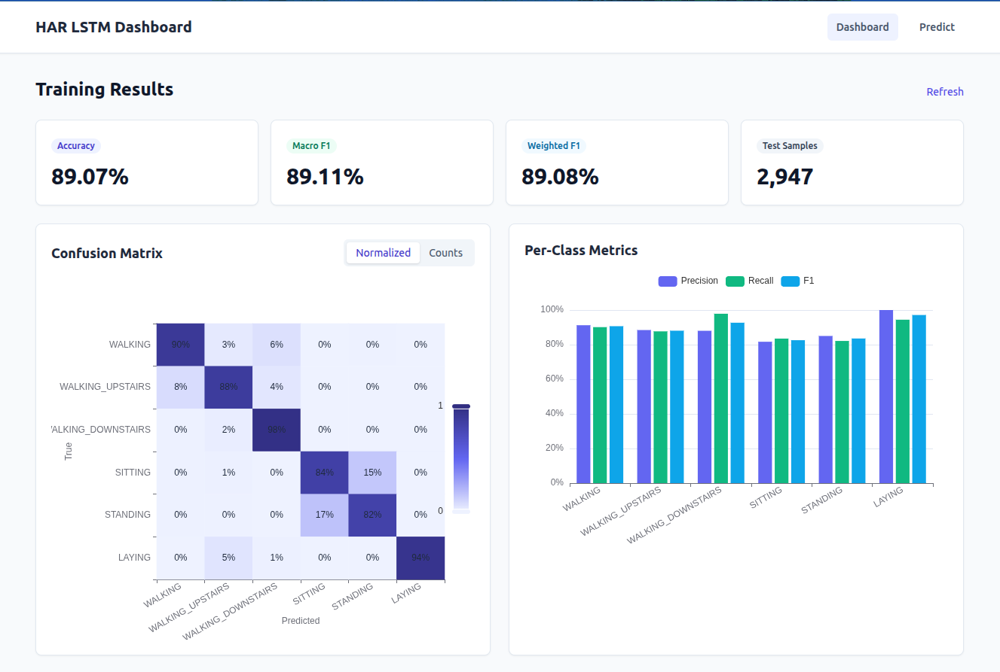

# Modern HAR LSTM — Human Activity Recognition Dashboard

UCI HAR 데이터셋(스마트폰 관성 센서)으로 6가지 인간 활동을 분류하는 LSTM 시스템. **학습 파이프라인(TensorFlow 2.10)** + **FastAPI 서빙** + **Vue 3 대시보드**로 구성된 풀스택 구현체다.



- **분류 대상 (6 classes)**: `WALKING`, `WALKING_UPSTAIRS`, `WALKING_DOWNSTAIRS`, `SITTING`, `STANDING`, `LAYING`
- **입력 형태**: `(128 timesteps, 9 channels)` — body acc x/y/z, body gyro x/y/z, total acc x/y/z (50 Hz · 2.56 s)
- **성능**: 테스트 정확도 ~91–93% (기본 프리셋 기준)

## 목차

1. [프로젝트 구조](#프로젝트-구조)
2. [요구 사항](#요구-사항)
3. [빠른 시작](#빠른-시작)
4. [학습 파이프라인 (CLI)](#학습-파이프라인-cli)
5. [API 서버](#api-서버)
6. [프론트엔드 대시보드](#프론트엔드-대시보드)
7. [모델 아키텍처](#모델-아키텍처)
8. [데이터셋](#데이터셋)
9. [문서](#문서)

## 프로젝트 구조

```
modern-har-lstm/
├── backend/                    # Python 학습 + 서빙
│   ├── config.py               # Config / ConfigPresets
│   ├── data_loader.py          # DataLoader · DataPreprocessor (subject-aware split)
│   ├── model.py                # HARModel · ModelBuilder (simple/deep/bidirectional)
│   ├── evaluator.py            # ModelEvaluator · ErrorAnalyzer
│   ├── visualizer.py           # 학습 PNG 리포트
│   ├── main.py                 # CLI 엔트리포인트
│   ├── best_model.keras        # 학습된 가중치 (서빙 대상)
│   ├── requirements.txt        # 학습용 의존성
│   ├── requirements-api.txt    # FastAPI 추가 의존성
│   └── api/
│       ├── app.py              # FastAPI 앱 (lifespan · CORS · 라우터)
│       ├── deps.py             # AppState 싱글턴 · 환경 초기화
│       ├── schemas.py          # Pydantic I/O 스키마
│       └── routes/             # health · metrics · samples · predict
├── frontend/                   # Vue 3 + Vite + Pinia + ECharts
│   └── src/
│       ├── api/                # axios client · endpoints
│       ├── stores/             # Pinia (metrics, samples)
│       ├── views/              # DashboardView · PredictView
│       └── components/         # 5 ECharts/카드 컴포넌트
├── data/                       # UCI HAR Dataset (최초 실행 시 자동 다운로드)
├── results/                    # 평가 리포트 (JSON · CSV · TXT)
├── visualizations/             # 학습 시 저장된 PNG
├── sample_inputs/              # 업로드 예측용 샘플 (.txt/.csv/.json)
└── docs/
    ├── architecture.md         # 계층별 설계 문서
    └── uml.md                  # Mermaid 다이어그램 모음
```

## 요구 사항

| Layer     | Version                                             |
|-----------|-----------------------------------------------------|
| Python    | 3.10 (conda env: `py310_tf`)                        |
| TF/Keras  | 2.10.\*                                             |
| Node.js   | ≥ 18.20, < 19 (`.nvmrc` 명시)                        |
| OS        | Linux / macOS (스크립트가 POSIX 경로 사용)            |

## 빠른 시작

```bash
# 1. Python 의존성
conda activate py310_tf   # 프로젝트 권장 환경
pip install -r backend/requirements.txt
pip install -r backend/requirements-api.txt

# 2. 모델 학습 (best_model.keras 생성)
python -m backend.main --config default --save_visualizations

# 3. API 서버 기동 (:8000)
uvicorn backend.api.app:app --port 8000 --reload

# 4. 프론트엔드 개발 서버 (:5173)
cd frontend
npm install
npm run dev
# 브라우저: http://localhost:5173
```

Vite dev 서버가 `/api/*` 호출을 `http://127.0.0.1:8000`으로 프록시한다.

## 학습 파이프라인 (CLI)

`backend/main.py`는 설정 → 다운로드 → subject-aware 분할 → 모델 생성/학습 → 평가 → 오류 분석 → 시각화 → 리포트 저장까지 수행한다.

```bash
# 기본 학습
python -m backend.main --config default

# 빠른 검증 (10 epochs)
python -m backend.main --config quick

# 고성능 프리셋 (200 epochs · 더 큰 LSTM)
python -m backend.main --config high_performance

# 아키텍처 변경
python -m backend.main --model_type bidirectional
python -m backend.main --model_type deep
python -m backend.main --model_type simple

# 하이퍼파라미터 오버라이드
python -m backend.main --epochs 50 --batch_size 128 --learning_rate 0.001

# 기존 모델만 로드해 평가
python -m backend.main --skip_training
```

주요 옵션:

| Flag                    | 설명                                                                   |
|-------------------------|------------------------------------------------------------------------|
| `--config`              | `default` \| `quick` \| `high_performance` \| `lightweight`           |
| `--model_type`          | `standard` \| `simple` \| `deep` \| `bidirectional`                    |
| `--epochs` `--batch_size` `--learning_rate` `--lstm_units` | 하이퍼파라미터 오버라이드        |
| `--save_visualizations` | `visualizations/`에 PNG 저장                                            |
| `--skip_training`       | 학습 건너뛰고 `best_model.keras` 로드 후 평가                            |
| `--model_path`          | 모델 저장/로드 경로 지정 (기본: `backend/best_model.keras`)              |
| `--seed`                | Python/NumPy/TF 시드 고정 (기본 42)                                     |

학습 산출물:
- `backend/best_model.keras` — 체크포인트 (`save_best_only=True` 기준 최고 val_loss)
- `results/performance_report_*.txt` · `evaluation_results_*.json` · `confusion_matrix_*.csv`
- `visualizations/*.png` (`--save_visualizations` 사용 시)

## API 서버

`backend/api/app.py`의 FastAPI 앱은 startup 시점(`lifespan`)에 ① 모델 로드, ② 테스트셋 전체 예측, ③ 메트릭(요약·혼동 행렬·클래스별) 계산·캐시를 모두 완료한다. 이후 라우트는 캐시만 읽어 O(1) 응답을 제공한다.

```bash
uvicorn backend.api.app:app --port 8000 --reload
# OpenAPI UI: http://127.0.0.1:8000/docs
```

| Method | Path                                | 응답                                                 |
|--------|-------------------------------------|------------------------------------------------------|
| GET    | `/api/health`                       | 모델 상태 · 모델 경로 · 테스트셋 크기 · 라벨 목록    |
| GET    | `/api/metrics/summary`              | accuracy, macro/weighted precision·recall·F1        |
| GET    | `/api/metrics/confusion-matrix`     | counts + row-normalized 행렬                         |
| GET    | `/api/metrics/per-class`            | 클래스별 precision / recall / F1 / support           |
| GET    | `/api/samples`                      | 테스트셋 크기 + 라벨 목록                             |
| GET    | `/api/samples/{idx}`                | 인덱스별 샘플 신호 + 정답                             |
| GET    | `/api/samples/random`               | 임의 테스트 샘플                                      |
| POST   | `/api/predict`                      | JSON `{signal: number[128][9]}` → 예측                |
| POST   | `/api/predict/upload`               | multipart 업로드(`.json` / `.csv` / `.txt`) → 예측  |

`sample_inputs/`에 활동별 업로드 예시가 들어 있다. JSON은 `{"signal": [[...]]}` 또는 2D 배열 그대로, CSV/TXT는 헤더 유무를 자동 감지한다. 입력 검증 실패 시 422, 파일 파싱 실패 시 422, 모델 로딩 전 호출 시 503을 반환한다.

**추론은 CPU 강제**(`CUDA_VISIBLE_DEVICES=-1`) — 서빙 편의상 GPU 없이도 즉시 동작한다.

## 프론트엔드 대시보드

Vue 3 `<script setup>` + TypeScript + Pinia + ECharts + Tailwind CSS 3.

```bash
cd frontend
npm install
npm run dev       # 개발
npm run build     # 프로덕션 번들 → dist/
npm run type-check
```

라우팅:

- `/dashboard` — 학습 결과 요약. SummaryCards(accuracy · macro F1 · weighted F1 · 샘플 수) + Confusion Matrix 히트맵(Normalized/Counts 토글) + 클래스별 precision/recall/F1 그룹 막대.
- `/predict` — 세 가지 입력 경로를 제공한다. ① 테스트셋 인덱스 선택, ② 랜덤 샘플, ③ 파일 업로드. 결과는 클래스별 확률 막대와 9채널 신호(3×3 small multiples)로 표시된다.

`frontend/src/types.ts`가 Pydantic 응답과 1:1 매칭되는 TS 타입을 선언해 API 스키마 변경 시 호출부를 컴파일러가 잡아낸다.

## 모델 아키텍처

기본 (`standard`, `backend/model.py` — `HARModel`):

```
Input (128, 9)
  → LSTM(32, return_sequences=True, dropout=0.3, L2=0.001)
  → LSTM(32, dropout=0.3, L2=0.001)
  → Dense(32, relu, L2=0.001)
  → Dropout(0.3)
  → Dense(6, softmax)

optimizer = Adam(lr=0.001)
loss      = sparse_categorical_crossentropy
callbacks = EarlyStopping(patience=15) · ReduceLROnPlateau(patience=10) · ModelCheckpoint(save_best_only)
```

대안 (`ModelBuilder`):

- `simple` — 단일 LSTM(32) + Dense(softmax). 빠른 실험용.
- `deep` — LSTM 3-스택 + Dense 헤드. 표현력↑, 학습시간↑.
- `bidirectional` — Bi-LSTM 2-스택. 양방향 문맥, 비용↑.

`recurrent_dropout=0`으로 cuDNN 커널 최적화 경로를 유지한다.

## 데이터셋

[UCI Human Activity Recognition Using Smartphones](https://archive.ics.uci.edu/ml/machine-learning-databases/00240/UCI%20HAR%20Dataset.zip) — 30명의 피험자, 스마트폰 가속도계+자이로스코프, 훈련 7,352 / 테스트 2,947 샘플. 최초 학습 실행 시 `data/UCI HAR Dataset/`에 자동 다운로드된다.

**Subject-aware split**: `DataPreprocessor.subject_aware_split`이 `GroupShuffleSplit`으로 train/val을 **피험자 단위로 분리**한다. 동일 피험자의 윈도우가 train/val에 동시에 들어가면 성능이 낙관적으로 왜곡되므로, 이 경계를 엄격히 지킨다.

## 문서

- [`docs/architecture.md`](docs/architecture.md) — 학습·서빙·프론트엔드 3 계층의 모듈 설계, 데이터 플로우, 주요 설계 결정.
- [`docs/uml.md`](docs/uml.md) — Mermaid 기반 Component · Class · Sequence · State · Deployment 다이어그램.

---

**즐거운 활동 인식! 🏃‍♀️🚶‍♂️**
