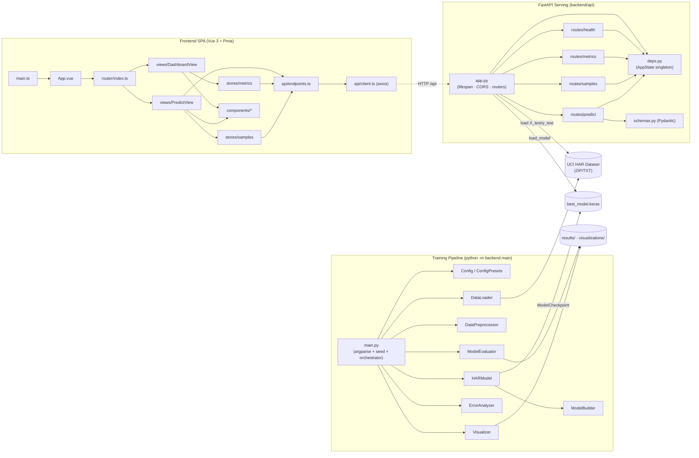
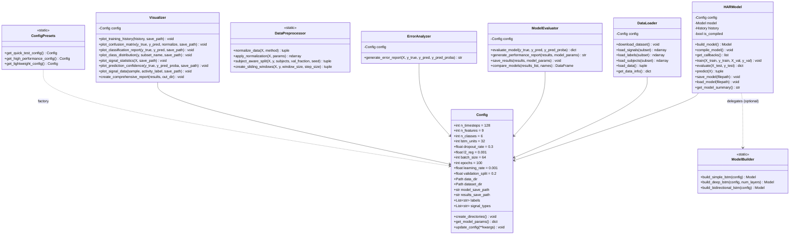
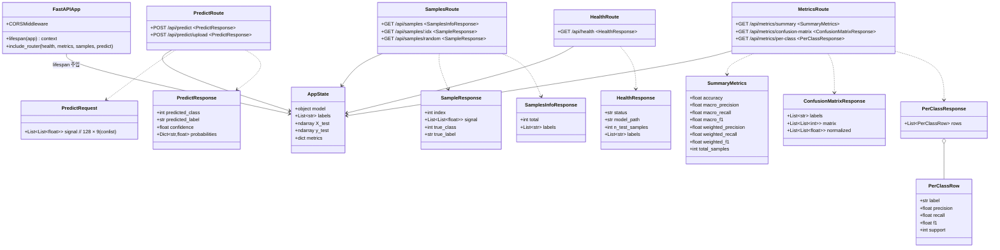
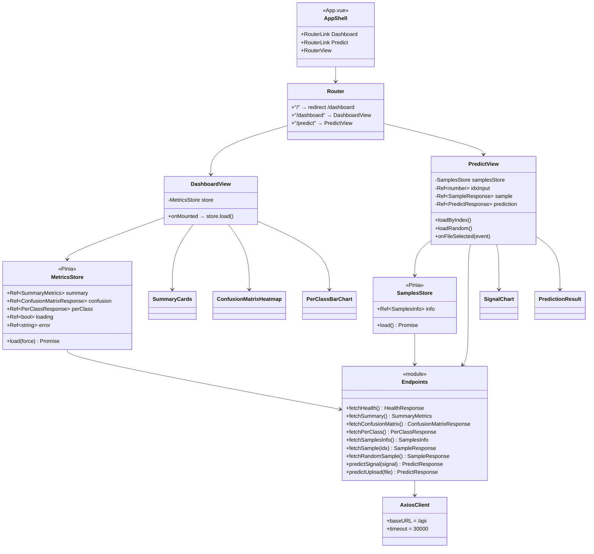
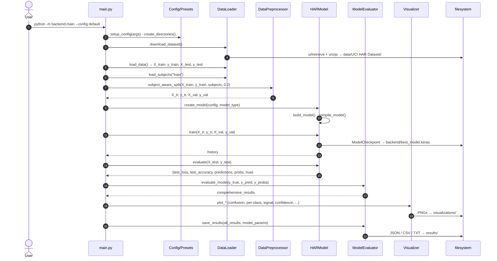
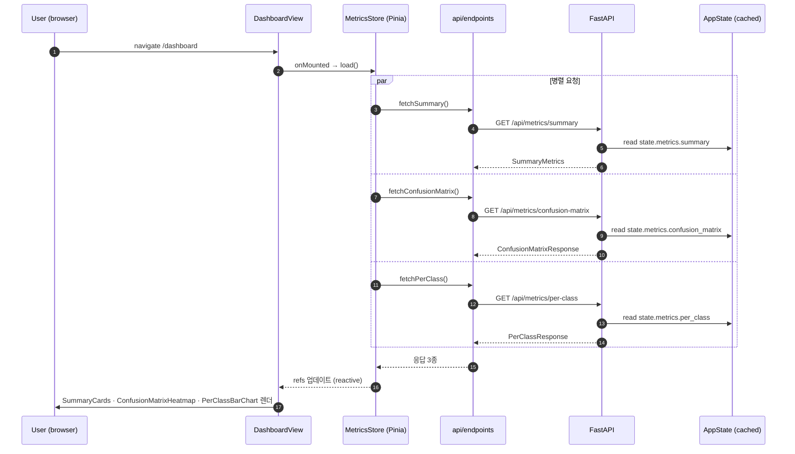
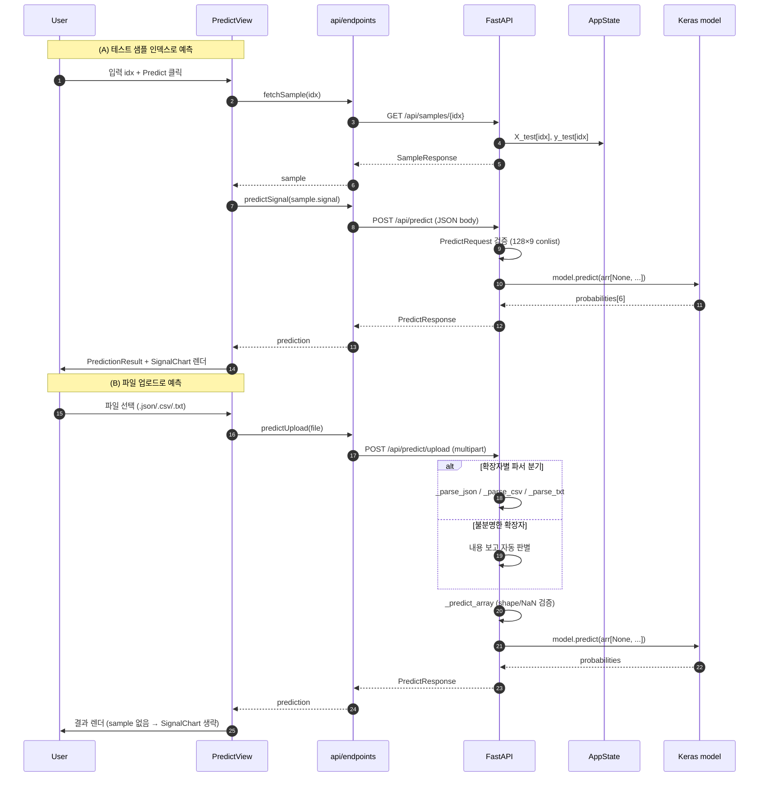
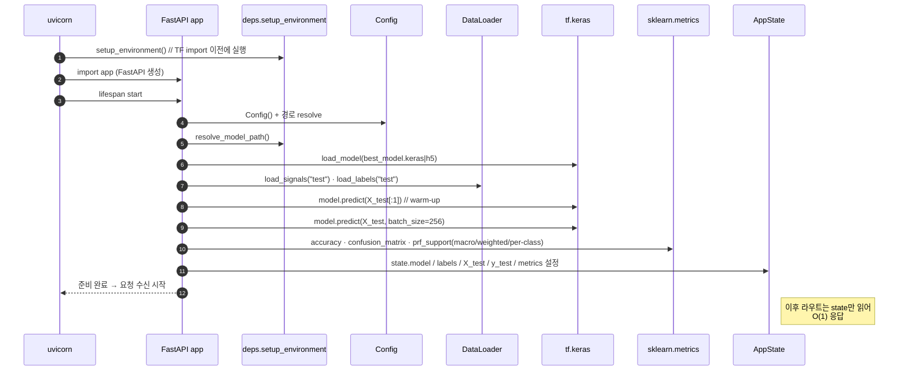
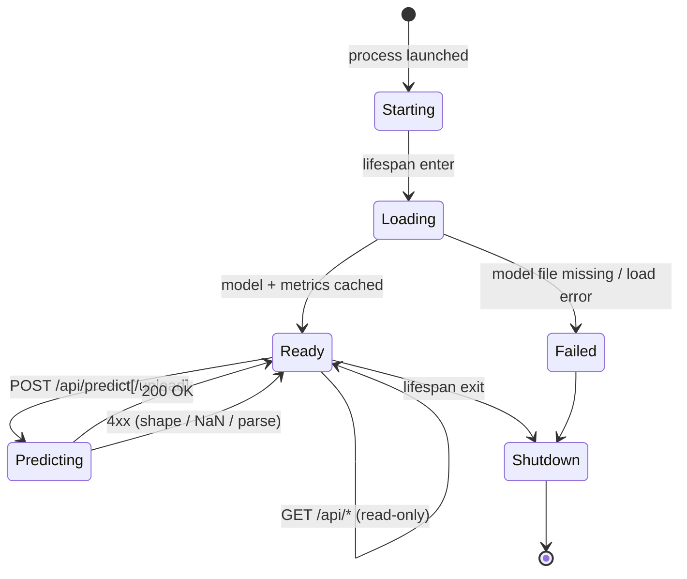
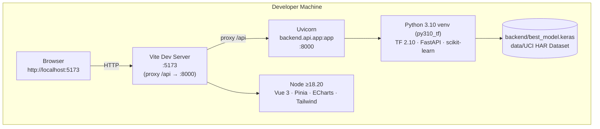

# UML — Modern HAR LSTM

Mermaid 기반 다이어그램 모음. GitHub·PyCharm·VS Code의 Mermaid 뷰어에서 바로 렌더된다. 구조는 `architecture.md` 와 짝을 이룬다.

## 1. Component Diagram — 시스템 구성

## 2. Class Diagram — 백엔드 핵심 클래스

## 3. Class Diagram — API 계층

## 4. Class Diagram — 프론트엔드 모듈

## 5. Sequence Diagram — 학습 실행 흐름

## 6. Sequence Diagram — 대시보드 초기 로드

## 7. Sequence Diagram — 예측 (인덱스 / 업로드)

## 8. Sequence Diagram — API 기동 (lifespan)

## 9. State Diagram — `AppState` 라이프사이클

## 10. Deployment Diagram — 개발 환경

---

**주석:**
- 도식의 필드/메서드는 현재 코드 기준의 공개 API에 한정했다. 내부 헬퍼(`_build_sample`, `_parse_json` 등)는 흐름 다이어그램에만 등장한다.
- 프론트엔드의 Vue 컴포넌트는 클래스가 아니지만 `<script setup>` 노출 심볼을 의사(class)로 표기했다.
